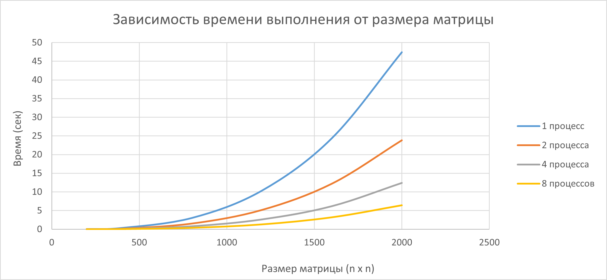

# Лабораторная работа №5: Запуск MPI-программы на суперкомпьютере «Сергей Королёв»
## Автор
- **Студент:** Святковская П.Б.
- **Группа:** 6312
- **Курс:** Параллельное программирование

---

## Цель работы
Запустить параллельную версию программы умножения матриц (MPI) на суперкомпьютере «Сергей Королёв», провести эксперименты с разным количеством процессов (1, 2, 4, 8) и разными размерами матриц (200, 400, 800, 1200, 1600, 2000).

---

## Реализация
Для работы на суперкомпьютере программа была адаптирована: удалены операции сохранения в файлы, вывод результатов осуществляется только в терминал.
### Алгоритм умножения
Используется параллельный алгоритм с распределением строк матрицы A между процессами:

```cpp
#include <iostream>
#include <mpi.h>
#include <vector>
#include <cstdlib>
#include <ctime>

using namespace std;

double randDouble() {
    return (double)rand() / RAND_MAX * 100.0;
}

vector<vector<double> > generateMatrix(int n) {
    vector<vector<double> > matrix(n, vector<double>(n));
    for (int i = 0; i < n; ++i)
        for (int j = 0; j < n; ++j)
            matrix[i][j] = randDouble();
    return matrix;
}

vector<double> flattenMatrix(const vector<vector<double> >& matrix) {
    int n = matrix.size();
    vector<double> flat(n * n);
    for (int i = 0; i < n; ++i)
        for (int j = 0; j < n; ++j)
            flat[i * n + j] = matrix[i][j];
    return flat;
}

int main(int argc, char** argv) {
    MPI_Init(&argc, &argv);

    int world_rank, world_size;
    MPI_Comm_rank(MPI_COMM_WORLD, &world_rank);
    MPI_Comm_size(MPI_COMM_WORLD, &world_size);

    srand(time(NULL) + world_rank);

    int sizes[] = { 200, 400, 800, 1200, 1600, 2000 };
    int numSizes = 6;

    if (world_rank == 0) {
        cout << "MPI MATRIX MULTIPLICATION\n" << endl;
        cout << "Total processes: " << world_size << endl;
    }

    for (int i = 0; i < numSizes; ++i) {
        int n = sizes[i];

        if (n % world_size != 0) {
            if (world_rank == 0) {
                cerr << "Error: size " << n << " not divisible by " << world_size << endl;
            }
            continue;
        }

        int rows_per_proc = n / world_size;

        vector<double> flat_A, flat_B;
        vector<double> local_A(rows_per_proc * n);
        vector<double> local_C(rows_per_proc * n);

        double elapsed = 0.0;

        if (world_rank == 0) {
            cout << "\nSize " << n << "x" << n << endl;
            cout << "Generating matrices..." << endl;

            vector<vector<double> > A = generateMatrix(n);
            vector<vector<double> > B = generateMatrix(n);

            flat_A = flattenMatrix(A);
            flat_B = flattenMatrix(B);

            cout << "Multiplying... (processes: " << world_size << ")" << endl;
        }

        if (world_rank != 0) {
            flat_B.resize(n * n);
        }
        MPI_Bcast(&flat_B[0], n * n, MPI_DOUBLE, 0, MPI_COMM_WORLD);

        if (world_rank == 0) {
            MPI_Scatter(&flat_A[0], rows_per_proc * n, MPI_DOUBLE,
                &local_A[0], rows_per_proc * n, MPI_DOUBLE,
                0, MPI_COMM_WORLD);
        }
        else {
            MPI_Scatter(NULL, rows_per_proc * n, MPI_DOUBLE,
                &local_A[0], rows_per_proc * n, MPI_DOUBLE,
                0, MPI_COMM_WORLD);
        }

        MPI_Barrier(MPI_COMM_WORLD);
        double start_time = MPI_Wtime();

        for (int i_row = 0; i_row < rows_per_proc; ++i_row) {
            for (int j = 0; j < n; ++j) {
                double sum = 0.0;
                for (int k = 0; k < n; ++k) {
                    sum += local_A[i_row * n + k] * flat_B[k * n + j];
                }
                local_C[i_row * n + j] = sum;
            }
        }

        MPI_Barrier(MPI_COMM_WORLD);
        double end_time = MPI_Wtime();
        elapsed = end_time - start_time;

        MPI_Barrier(MPI_COMM_WORLD);

        if (world_rank == 0) {
            cout << "  Time: " << elapsed << " sec" << endl;
        }
    }

    if (world_rank == 0) {
        cout << "\n" << endl;
        cout << "ALL EXPERIMENTS COMPLETED" << endl;
    }

    MPI_Finalize();
    return 0;
}
```
### PBS-скрипт для запуска
```bash
#!/bin/bash
#SBATCH --job-name=matMulMPI
#SBATCH --time=0:05:00
#SBATCH --ntasks-per-node=1
#SBATCH --partition batch

module load intel/mpi4
mpirun -r ssh ./matMulMPI 1000

```

### График зависимости времени от размера матрицы и числа процессов


### Анализ
1. **Временная сложность:** Время выполнения растет пропорционально **O(n³)** для любого количества процессов, что соответствует теоретической сложности алгоритма умножения матриц.

2. **Эффективность параллелизации:** 
   - Ускорение остаётся стабильно высоким для всех размеров матриц

3. **Масштабируемость:** MPI эффективно масштабируется до 8 процессов


## Выводы

В ходе выполнения лабораторной работы №5 параллельная MPI-программа успешно запущена на суперкомпьютере «Сергей Королёв». Проведены эксперименты с разным количеством процессов и размерами матриц. Результаты показали, что MPI демонстрирует высокую масштабируемость - увеличение числа процессов приводит к росту производительности. Цель работы полностью достигнута.
