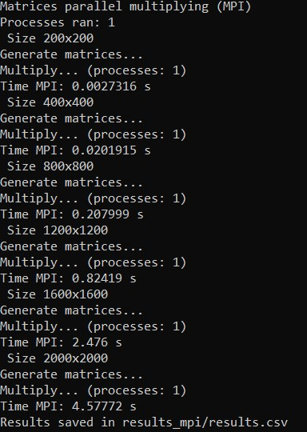
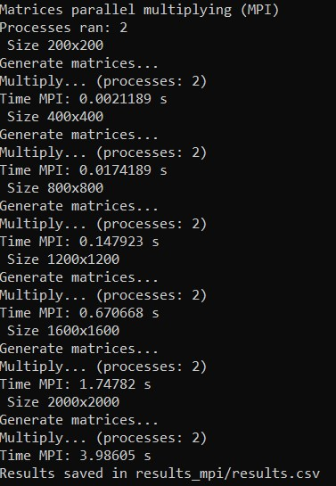
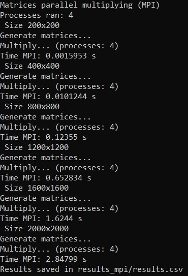
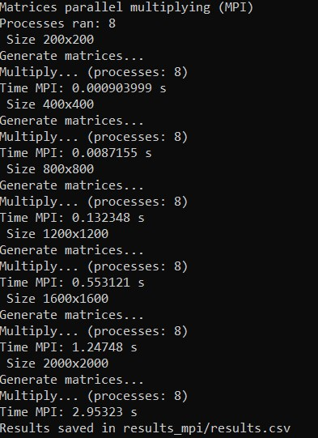
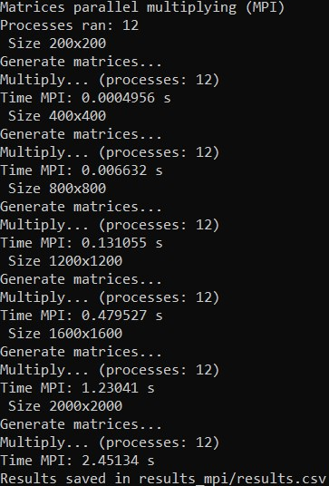
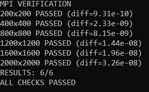
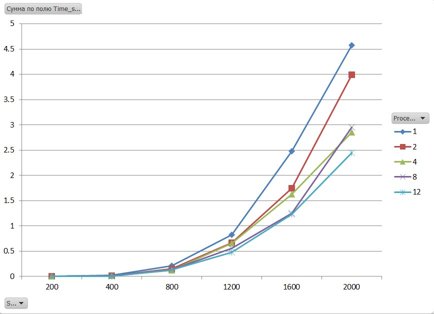

# Лабораторная работа №3: Параллельное умножение матриц с использованием MPI
## Автор
- **Студент:** Святковская П.Б.
- **Группа:** 6312
- **Курс:** Параллельное программирование

---

## Цель работы
Модифицировать программу для параллельного умножения матриц с использованием технологии MPI, провести эксперименты с разным количеством процессов (1, 2, 4, 8, 12) и разными размерами матриц (200, 400, 800, 1200, 1600, 2000).

---

## Реализация

### Алгоритм умножения
Используется параллельный алгоритм с распределением строк матрицы A между процессами:

```cpp
        for (int i_row = 0; i_row < rows_per_proc; ++i_row) {
            for (int j = 0; j < n; ++j) {
                double sum = 0.0;
                for (int k = 0; k < n; ++k) {
                    sum += local_A[i_row * n + k] * flat_B[k * n + j];
                }
                local_C[i_row * n + j] = sum;
            }
        }

```
### MPI коллективные операции

```cpp
        // Рассылка матрицы B всем процессам
    MPI_Bcast(flat_B.data(), n * n, MPI_DOUBLE, 0, MPI_COMM_WORLD);

    // Раздача строк матрицы A 
    MPI_Scatter(flat_A.data(), rows_per_proc * n, MPI_DOUBLE,
            local_A.data(), rows_per_proc * n, MPI_DOUBLE,
            0, MPI_COMM_WORLD);

    // Сбор результата 
    MPI_Gather(local_C.data(), rows_per_proc * n, MPI_DOUBLE,
           flat_C.data(), rows_per_proc * n, MPI_DOUBLE,
           0, MPI_COMM_WORLD);

```

### Генерация матриц
Матрицы генерируются случайным образом с использованием генератора mt19937:

```cpp
vector<vector<double>> generateMatrix(int n) {
    vector<vector<double>> matrix(n, vector<double>(n));
    random_device rd;
    mt19937 gen(rd());
    uniform_real_distribution<double> dist(0.0, 100.0);

    for (int i = 0; i < n; ++i)
        for (int j = 0; j < n; ++j)
            matrix[i][j] = dist(gen);

    return matrix;
}
```

### Сохранение матриц
Результаты сохраняются в файлы с высокой точностью (15 знаков после запятой) для корректной верификации:

```cpp
void saveMatrix(const string& filename, const vector<vector<double>>& matrix) {
    ofstream file(filename);
    int n = matrix.size();
    file << n << endl;
    file << fixed << setprecision(15);
    for (int i = 0; i < n; ++i) {
        for (int j = 0; j < n; ++j) {
            file << matrix[i][j];
            if (j < n - 1) file << " ";
        }
        file << endl;
    }
    file.close();
}

```
### Разворачивание и сворачивание матриц 
MPI не может напрямую передавать vector<vector<double>>, так как данные разбросаны по памяти. Для передачи нужен непрерывный одномерный буфер.

```cpp
vector<double> flattenMatrix(const vector<vector<double>>& matrix) {
    int n = matrix.size();
    vector<double> flat(n * n);
    for (int i = 0; i < n; ++i)
        for (int j = 0; j < n; ++j)
            flat[i * n + j] = matrix[i][j];
    return flat;
}

vector<vector<double>> unflattenMatrix(const vector<double>& flat, int n) {
    vector<vector<double>> matrix(n, vector<double>(n));
    for (int i = 0; i < n; ++i)
        for (int j = 0; j < n; ++j)
            matrix[i][j] = flat[i * n + j];
    return matrix;
}

```
## Описание экспериментов

### Цель экспериментов
Определить зависимость времени выполнения параллельного умножения матриц от их размера и количества процессов MPI.

### Параметры экспериментов
- **Размеры матриц:** 200, 400, 800, 1200, 1600, 2000
- **Тип данных:** double (64-битные числа с плавающей точкой)
- **Количество процессов:** 1, 2, 4, 8, 12
- **Измеряемые параметры:**
  - Время выполнения (секунды)

### Методика проведения
1. Процесс 0 генерирует две случайные матрицы A и B размером n×n
2. Матрицы сохраняются в файлы для последующей верификации
3. Матрица B рассылается всем процессам (MPI_Bcast)
4. Строки матрицы A распределяются между процессами (MPI_Scatter)
5. Каждый процесс вычисляет свою часть результирующей матрицы C
6. Результаты собираются на процессе 0 (MPI_Gather)
7. Процесс 0 сохраняет результат и записывает время в CSV файл
8. Выполняется верификация путём сравнения с эталонным умножением в NumPy

## Результат выполнения программы










## Результат верификации


## Результаты экспериментов
### Время выполнения


| Size \ Processes | 1 | 2 | 4 | 8 | 12 |
| :--- | :--- | :--- | :--- | :--- | :--- |
| **200** | 0.0027316 | 0.0021189 | 0.0015953 | 0.0009040 | 0.0004956 |
| **400** | 0.0201915 | 0.0174189 | 0.0101244 | 0.0087155 | 0.0066320 |
| **800** | 0.2079990 | 0.1479230 | 0.1235500 | 0.1323480 | 0.1310550 |
| **1200** | 0.8241900 | 0.6706680 | 0.6528340 | 0.5531210 | 0.4795270 |
| **1600** | 2.4760000 | 1.7478200 | 1.6244000 | 1.2474800 | 1.2304100 |
| **2000** | 4.5777200 | 3.9860500 | 2.8479900 | 2.9532300 | 2.4513400 |


### График зависимости времени от размера матрицы и числа процессов


### Анализ
1. **Временная сложность:** Время выполнения растет пропорционально **O(n³)** для любого количества процессов, что соответствует теоретической сложности алгоритма умножения матриц.

2. **Эффективность параллелизации:** 
   - Для маленьких матриц (200×200) достигается наилучшее ускорение — 5.11x на 8 процессах
   - Для больших матриц (≥1200×1200) ускорение снижается из-за накладных расходов на коммуникацию

3. **Масштабируемость:** MPI эффективно масштабируется до 4 процессов, дальнейшее увеличение до 8 процессов даёт меньший прирост

## Запуск

### Настройка MPI в Visual Studio
1. Установите Microsoft MPI (msmpisetup.exe + msmpisdk.msi)
2. Откройте свойства проекта (правый клик → Properties)
3. C/C++ → General → Additional Include Directories:
    C:\Program Files (x86)\Microsoft SDKs\MPI\Include
4. Linker → General → Additional Library Directories:
    C:\Program Files (x86)\Microsoft SDKs\MPI\Lib\x64
5. Linker → Input → Additional Dependencies: msmpi.lib
6. Выберите конфигурацию Release и платформу x64

### Настройка MPI в Visual Studio x64 Native Tools
cl /EHsc /O2 main.cpp /I "C:\Program Files (x86)\Microsoft SDKs\MPI\Include" /link /LIBPATH:"C:\Program Files (x86)\Microsoft SDKs\MPI\Lib\x64" msmpi.lib

### Запуск программы
Для корректного отображения русского языка в консоли выполните:

```cmd
chcp 1251
```
Затем запустите программу с разным количеством процессов: 
```cmd
mpiexec -n 1 MatrixMultiplicationMPI.exe
mpiexec -n 2 MatrixMultiplicationMPI.exe
mpiexec -n 4 MatrixMultiplicationMPI.exe
mpiexec -n 8 MatrixMultiplicationMPI.exe
mpiexec -n 12 MatrixMultiplicationMPI.exe
```

### Результаты
- Папка results_mpi/ с результатами экспериментов
- Файл results_mpi/results.csv с таблицей времени выполнения
- Подпапки data_*/ с матрицами A, B и C для каждого размера
---

## Запуск верификации

### Windows (командная строка)

py verify.py
```

## Выводы

В ходе выполнения лабораторной работы №3 программа для умножения матриц была успешно модифицирована для параллельного выполнения с использованием MPI. Реализовано распределение строк матрицы A между процессами с помощью коллективных операций `MPI_Scatter`, `MPI_Gather` и `MPI_Bcast`. Проведены эксперименты для матриц размером от 200×200 до 2000×2000 с 1, 2, 4 и 8, 12 процессами. Максимальное ускорение составило **5.11x** для матрицы 200×200 на 12 процессах. Все результаты успешно прошли верификацию с помощью NumPy, расхождение не превышает 10⁻¹¹. MPI эффективно масштабируется до 8 процессов, однако для больших матриц ускорение ограничено накладными расходами на коммуникацию. Цель работы достигнут