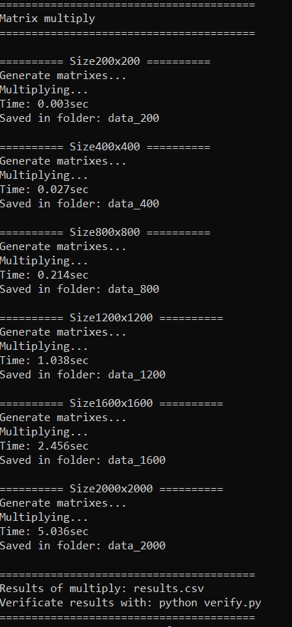

# Лабораторная работа №1: Последовательное умножение матриц

## Автор
- **Студент:** Святковская П.Б.
- **Группа:** 6312
- **Курс:** Параллельное программирование

---

## Цель работы
Разработать программу на языке C++ для умножения двух квадратных матриц, провести эксперименты с различными размерами матриц, выполнить верификацию результатов с помощью Python/NumPy.

---

## Реализация

### Алгоритм умножения
Используется оптимизированный порядок циклов **i-k-j**, который обеспечивает эффективное использование кэш-памяти процессора:

```cpp
vector<vector<double>> multiply(const vector<vector<double>>& A,
    const vector<vector<double>>& B) {
    int n = A.size();
    vector<vector<double>> C(n, vector<double>(n, 0.0));

    for (int i = 0; i < n; ++i)
        for (int k = 0; k < n; ++k)
            for (int j = 0; j < n; ++j)
                C[i][j] += A[i][k] * B[k][j];

    return C;
}
```


### Генерация матриц
Матрицы генерируются случайным образом с использованием генератора mt19937:

```cpp
vector<vector<double>> generateMatrix(int n) {
    vector<vector<double>> matrix(n, vector<double>(n));
    random_device rd;
    mt19937 gen(rd());
    uniform_real_distribution<double> dist(0.0, 100.0);

    for (int i = 0; i < n; ++i)
        for (int j = 0; j < n; ++j)
            matrix[i][j] = dist(gen);

    return matrix;
}
```

### Сохранение матриц
Результаты сохраняются в файлы с высокой точностью (15 знаков после запятой) для корректной верификации:

```cpp
void saveMatrix(const string& filename, const vector<vector<double>>& matrix) {
    ofstream file(filename);
    int n = matrix.size();
    file << n << endl;
    file << fixed << setprecision(15);
    for (int i = 0; i < n; ++i) {
        for (int j = 0; j < n; ++j) {
            file << matrix[i][j];
            if (j < n - 1) file << " ";
        }
        file << endl;
    }
    file.close();
}
```
### Верификация результата 
Скрипт verify.py
```python
import numpy as np
import os


def read_matrix(filename):
    """Read matrix from file"""
    try:
        with open(filename, 'r') as f:
            n = int(f.readline().strip())
            matrix = []
            for _ in range(n):
                row = list(map(float, f.readline().split()))
                matrix.append(row)
        return np.array(matrix)
    except Exception as e:
        print(f"reading error {filename}: {e}")
        return None


sizes = [200, 400, 800, 1200, 1600, 2000]


print("Results")


all_passed = True
passed_count = 0

for n in sizes:
    folder = f"data_{n}"

    if not os.path.exists(folder):
        print(f"folder {folder} not found")
        continue

    A = read_matrix(f"{folder}/A.txt")
    B = read_matrix(f"{folder}/B.txt")
    C_cpp = read_matrix(f"{folder}/C.txt")

    if A is None or B is None or C_cpp is None:
        print(f"Size {n}x{n}: cannot read files")
        all_passed = False
        continue

    C_ref = np.dot(A, B)

    diff = np.max(np.abs(C_cpp - C_ref))

    if diff < 1e-6:
        print(f"PASSED Size {n}x{n}: max difference = {diff:.2e}")
        passed_count += 1
    else:
        print(f"NOT PASSED Size {n}x{n}: max difference = {diff:.2e}")
        all_passed = False

        print(f"   First element C_cpp[0,0] = {C_cpp[0, 0]:.6f}")
        print(f"   First element C_ref[0,0] = {C_ref[0, 0]:.6f}")
        print(f"   First element A[0,0] = {A[0, 0]:.6f}")
        print(f"   First element B[0,0] = {B[0, 0]:.6f}")


print(f"Verification: {100.*passed_count/len(sizes)}% passed")
if all_passed:
    print("ALL RESULTS PASSED VERIFICATION")
else:
    print("NOT ALL RESULTS PASSED VERIFICATION")

```
## Описание экспериментов

### Цель экспериментов
Определить зависимость времени выполнения умножения матриц от их размера, а также оценить производительность алгоритма.

### Параметры экспериментов
- **Размеры матриц:** 200, 400, 800, 1200, 1600, 2000
- **Тип данных:** double
- **Количество экспериментов:** 6 (по одному на каждый размер)
- **Измеряемые параметры:** Время выполнения (секунды)


### Методика проведения
1. Для каждого размера n генерируются две случайные матрицы A и B размером n×n
2. Матрицы сохраняются в файлы для последующей верификации
3. Выполняется умножение матриц C = A × B с замером времени
4. Результат C сохраняется в файл
5. Выполняется верификация путем сравнения с эталонным умножением в NumPy

## Результаты

### Вывод основного приложения


### Вывод приложения для верификации результатов


### График на основе выходных данных results.csv


## Анализ
Время выполнения растет пропорционально O(n³)

## Запуск

### Windows 
1. Откройте коммандную строку
2. Перейдите в директорию с исполняемым файлом
3. Запустите исполняемый файл в консоли

## Запуск верификации

### Windows 
В той же директории напишите py verify.py

## Выводы

В ходе выполнения лабораторной работы была разработана программа на языке C++ для умножения квадратных матриц. Проведены эксперименты с матрицами размеров 200×200, 400×400, 800×800, 1200×1200, 1600×1600 и 2000×2000. Выполнена автоматизированная верификация результатов с помощью библиотеки NumPy на Python. Все 6 экспериментов успешно прошли верификацию
