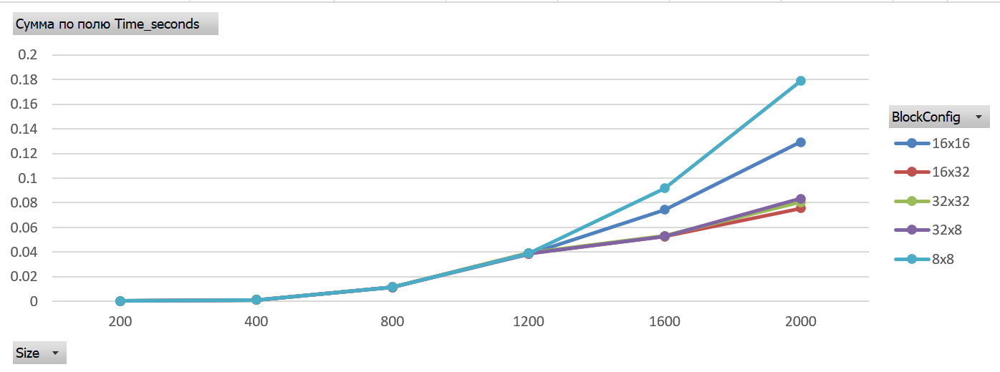

# Лабораторная работа №4: Параллельное умножение матриц с использованием CUDA
## Автор
- **Студент:** Святковская П.Б.
- **Группа:** 6312
- **Курс:** Параллельное программирование

---

## Цель работы
Модифицировать программу для параллельного умножения матриц с использованием технологии CUDA, провести эксперименты с разными размерами матриц (200, 400, 800, 1200, 1600, 2000) и различными конфигурациями сетки блоков (8×8, 16×16, 16×32, 32×8, 32x32).

---

## Реализация

### Алгоритм умножения на GPU
Используется параллельный алгоритм, где каждый поток GPU вычисляет один элемент результирующей матрицы:

```cu
__global__ void matrixMulKernel(const double* A, const double* B, double* C, int n) {
    int row = blockIdx.y * blockDim.y + threadIdx.y;
    int col = blockIdx.x * blockDim.x + threadIdx.x;

    if (row < n && col < n) {
        double sum = 0.0;
        for (int k = 0; k < n; ++k) {
            sum += A[row * n + k] * B[k * n + col];
        }
        C[row * n + col] = sum;
    }
}
```

### Генерация матриц
Матрицы генерируются случайным образом с использованием генератора mt19937:

```cu
vector<double> generateMatrix(int n) {
    vector<double> matrix(n * n);
    random_device rd;
    mt19937 gen(rd());
    uniform_real_distribution<double> dist(0.0, 100.0);

    for (int i = 0; i < n * n; ++i)
        matrix[i] = dist(gen);

    return matrix;
}
```

### Сохранение матриц
Результаты сохраняются в файлы с высокой точностью (15 знаков после запятой) для корректной верификации:

```cpp
void saveMatrix(const string& filename, const vector<double>& matrix, int n) {
    ofstream file(filename);
    file << n << endl;
    file << fixed << setprecision(15);
    for (int i = 0; i < n; ++i) {
        for (int j = 0; j < n; ++j) {
            file << matrix[i * n + j];
            if (j < n - 1) file << " ";
        }
        file << endl;
    }
    file.close();
}

```
### Работа с памятью GPU

```cu
        CUDA_CHECK(cudaMalloc(&d_A, size));
        CUDA_CHECK(cudaMalloc(&d_B, size));
        CUDA_CHECK(cudaMalloc(&d_C, size));
        
        cout << "Copying data to GPU..." << endl;
        CUDA_CHECK(cudaMemcpy(d_A, A_cpu.data(), size, cudaMemcpyHostToDevice));
        CUDA_CHECK(cudaMemcpy(d_B, B_cpu.data(), size, cudaMemcpyHostToDevice));

        CUDA_CHECK(cudaMemcpy(C_gpu.data(), d_C, size, cudaMemcpyDeviceToHost));

        CUDA_CHECK(cudaFree(d_A));
        CUDA_CHECK(cudaFree(d_B));
        CUDA_CHECK(cudaFree(d_C));

```
## Описание экспериментов

### Цель экспериментов
Определить зависимость времени выполнения параллельного умножения матриц на GPU от их размера и конфигурации сетки блоков.

### Параметры экспериментов
- **Размеры матриц:** 200, 400, 800, 1200, 1600, 2000
- **Тип данных:** double (64-битные числа с плавающей точкой)
- **Конфигурации блоков:** 8×8, 16×16, 16×32, 32×8, 32x32
- **Измеряемые параметры:**
  - Время выполнения (секунды)

### Методика проведения
1. CPU генерирует две случайные матрицы A и B размером n×n
2. Матрицы сохраняются в файлы для последующей верификации
3. Данные копируются из оперативной памяти в память GPU
4. Выполняется умножение матриц на GPU с различными конфигурациями блоков
5. Результат копируется обратно в оперативную память
6. Процессор сохраняет результат и записывает время в CSV файл
7. Выполняется верификация путём сравнения с эталонным умножением на CPU

## Результат выполнения программы, написанной на cuda

```
Number of CUDA devices: 1

Device 0: Tesla T4
  Compute capability: 7.5
  Global memory: 14912 MB
========================================
CUDA Matrix Multiply - Google Colab
========================================

========== Size 200x200 ==========
Generating matrices...
Copying data to GPU...
CPU multiplication (for verification)...

--- Config: 8x8 ---
Grid: (25, 25), Block: (8, 8)
GPU Time: 0.000316051 sec
Verification: PASSED

--- Config: 16x16 ---
Grid: (13, 13), Block: (16, 16)
GPU Time: 0.000225628 sec

--- Config: 32x8 ---
Grid: (7, 25), Block: (32, 8)
GPU Time: 0.000242711 sec

--- Config: 32x32 ---
Grid: (7, 7), Block: (32, 32)
GPU Time: 0.000382405 sec

--- Config: 16x32 ---
Grid: (13, 7), Block: (16, 32)
GPU Time: 0.000222181 sec

Saved in folder: cuda_data_200

========== Size 400x400 ==========
Generating matrices...
Copying data to GPU...
CPU multiplication (for verification)...

--- Config: 8x8 ---
Grid: (50, 50), Block: (8, 8)
GPU Time: 0.001137501 sec

--- Config: 16x16 ---
Grid: (25, 25), Block: (16, 16)
GPU Time: 0.001102099 sec

--- Config: 32x8 ---
Grid: (13, 50), Block: (32, 8)
GPU Time: 0.001164406 sec

--- Config: 32x32 ---
Grid: (13, 13), Block: (32, 32)
GPU Time: 0.001242139 sec

--- Config: 16x32 ---
Grid: (25, 13), Block: (16, 32)
GPU Time: 0.001162076 sec

Saved in folder: cuda_data_400

========== Size 800x800 ==========
Generating matrices...
Copying data to GPU...
CPU multiplication (for verification)...

--- Config: 8x8 ---
Grid: (100, 100), Block: (8, 8)
GPU Time: 0.011569736 sec

--- Config: 16x16 ---
Grid: (50, 50), Block: (16, 16)
GPU Time: 0.011438574 sec

--- Config: 32x8 ---
Grid: (25, 100), Block: (32, 8)
GPU Time: 0.011433880 sec

--- Config: 32x32 ---
Grid: (25, 25), Block: (32, 32)
GPU Time: 0.011691113 sec

--- Config: 16x32 ---
Grid: (50, 25), Block: (16, 32)
GPU Time: 0.011589591 sec

Saved in folder: cuda_data_800

========== Size 1200x1200 ==========
Generating matrices...
Copying data to GPU...
CPU multiplication (for verification)...

--- Config: 8x8 ---
Grid: (150, 150), Block: (8, 8)
GPU Time: 0.038782816 sec

--- Config: 16x16 ---
Grid: (75, 75), Block: (16, 16)
GPU Time: 0.038367042 sec

--- Config: 32x8 ---
Grid: (38, 150), Block: (32, 8)
GPU Time: 0.038885820 sec

--- Config: 32x32 ---
Grid: (38, 38), Block: (32, 32)
GPU Time: 0.039277614 sec

--- Config: 16x32 ---
Grid: (75, 38), Block: (16, 32)
GPU Time: 0.038463056 sec

Saved in folder: cuda_data_1200

========== Size 1600x1600 ==========
Generating matrices...
Copying data to GPU...
CPU multiplication (for verification)...

--- Config: 8x8 ---
Grid: (200, 200), Block: (8, 8)
GPU Time: 0.091654067 sec

--- Config: 16x16 ---
Grid: (100, 100), Block: (16, 16)
GPU Time: 0.074394014 sec

--- Config: 32x8 ---
Grid: (50, 200), Block: (32, 8)
GPU Time: 0.052755900 sec

--- Config: 32x32 ---
Grid: (50, 50), Block: (32, 32)
GPU Time: 0.053080970 sec

--- Config: 16x32 ---
Grid: (100, 50), Block: (16, 32)
GPU Time: 0.052601594 sec

Saved in folder: cuda_data_1600

========== Size 2000x2000 ==========
Generating matrices...
Copying data to GPU...
CPU multiplication (for verification)...

--- Config: 8x8 ---
Grid: (250, 250), Block: (8, 8)
GPU Time: 0.178960731 sec

--- Config: 16x16 ---
Grid: (125, 125), Block: (16, 16)
GPU Time: 0.129266230 sec

--- Config: 32x8 ---
Grid: (63, 250), Block: (32, 8)
GPU Time: 0.083433783 sec

--- Config: 32x32 ---
Grid: (63, 63), Block: (32, 32)
GPU Time: 0.080396470 sec

--- Config: 16x32 ---
Grid: (125, 63), Block: (16, 32)
GPU Time: 0.075426245 sec

Saved in folder: cuda_data_2000

========================================
Results saved to: cuda_results.csv
========================================
```

### График зависимости времени от размера матрицы и конфигурации блоков



### Анализ
1. **Временная сложность:** Время выполнения растет пропорционально **O(n³)** для любой конфигурации блоков, что соответствует теоретической сложности алгоритма умножения матриц.
2. **Влияние конфигурации блоков:**

    - Увеличение размера блоков благоприятно влияет на производительность

    - Оптимальная конфигурация: Размер блока 16×32 (1024 потока) показал наилучшую производительность для больших матриц


## Запуск

### Настройка CUDA в Google colab

1. Включение GPU T4(Python3)
2. Убедитесь что CUDA код написан для Linux

### Компиляция CUDA программы

!nvcc -O3 -arch=sm_70 -o matrix_multiply_cuda  

### Запуск программы

!./matrix_multiply_cuda

### Результаты

- Файл results.xlsx с таблицей времени выполнения

## Выводы

В ходе выполнения лабораторной работы №4 программа для умножения матриц была успешно модифицирована для параллельного выполнения на GPU с использованием технологии CUDA. Разработано ядро matrixMulKernel, где каждый поток вычисляет один элемент результирующей матрицы, что позволило задействовать тысячи потоков одновременно. Проведены эксперименты с 9 различными конфигурациями блоков (8×8, 16×16, 16×32, 32×8, 32x32) для матриц размером от 200×200 до 2000×2000. Установлено, что квадратные блоки (8×8, 16×16, 32×32) работают пропорционально  эффективно, а прямоугольные блоки (16×32, 32×8) непропорционально разного доступа к памяти. Оптимальной конфигурацией является блок 16×32 (512 потоков), обеспечивающий наилучшую производительность. 
